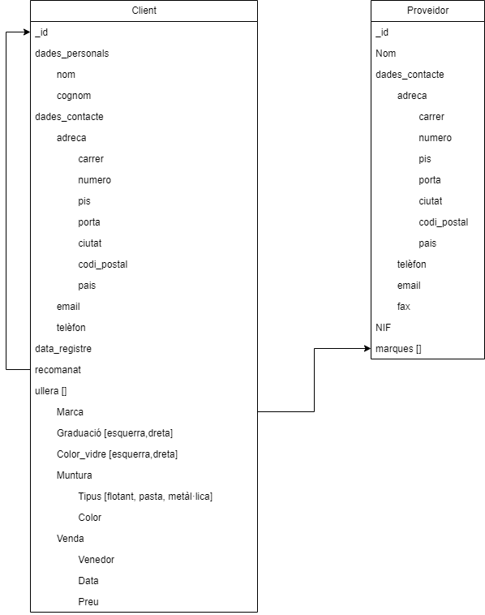
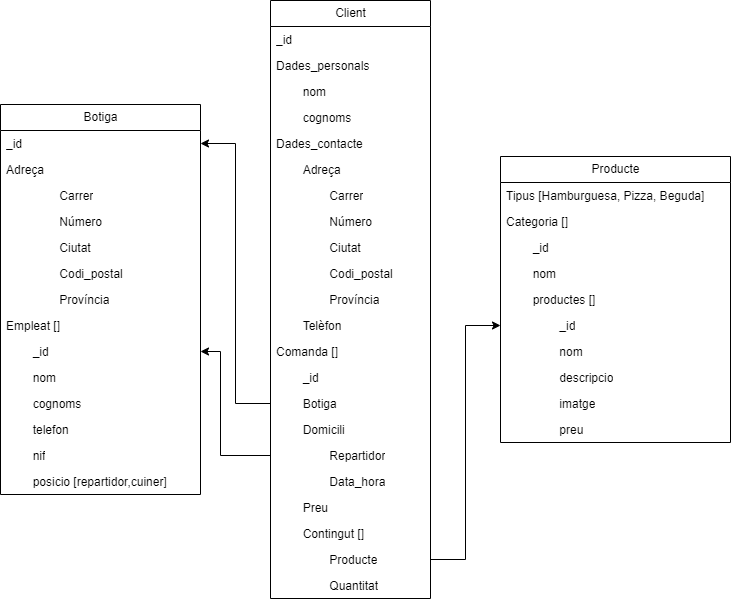
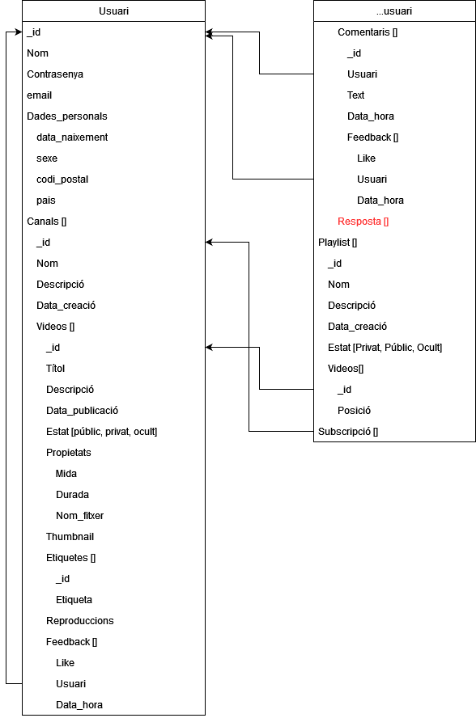
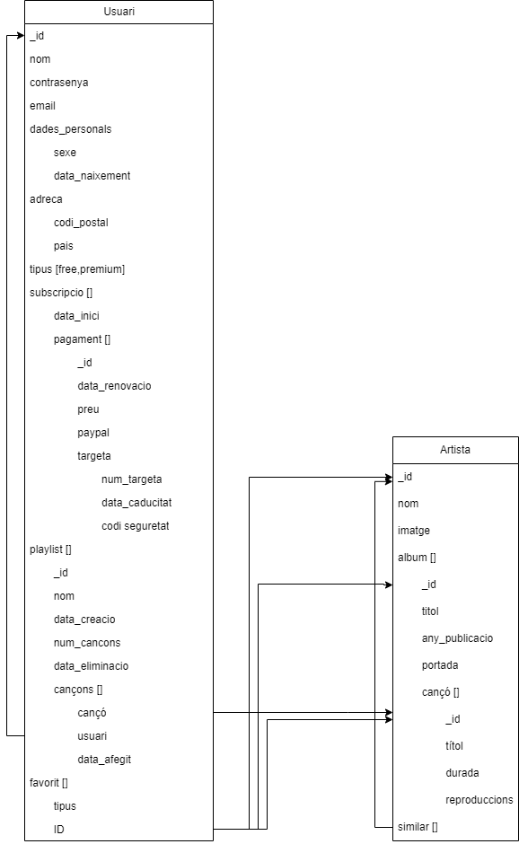

# Entrega 1

## Nivell 1 - Exercici 1 - Òptica

En negreta els valors requerits.s

## Nivell 1 - Exercici 2 - Pizzeria

En la comanda, el contingut és un array d'obejctes, en el qual cada objecte hi ha especificat 1 producte i la quantiat d'aquest producte.

En la comanda, la data de repartiment no està requerida ja que quan s'accepta la comanda, aquest valor seria _NULL_ fins que no és repartida.

## Nivell 2 - Youtube

El tema de les etiqutes i la necessitat que tinguin un identificador únic.

<!--
Unique items
https://www.mongodb.com/docs/atlas/app-services/schemas/enforce-a-schema/

-->

## Nivell 3 - Spotify

Les subscripcions són un array en el qual es guarda per item, totes les renovacions consecutives. És a dir, per item, hi ha una data d'inici, i a dins un array amb les renovacions pertenint. Per cada renovació, es guarda la data i el mètode de pagament. Si deixes de renovar, i passes de premium a free, quan tornis a voler ser premium, es crearà un nou item a l'array subscripció. Així també controles d'alguna manera la _fidelitat_ i si un usuari ha anat passant de premium->free->premium que algun altre.

Els favorits, tant seguir artista, com fer favorit a un album o cançó es guarda tot a l'array favortis, en el qual cada item és un objecte on s'hi especifica, el tipus (és a dir, artista, àlbum, cançó) i l'ID pertinent de l'artista, àlbum, cançó.

En quant a les llistes de reproducció. Saber si està activa o eliminada se sap per si el camp data_eliminacio existeix i té un valor, o no.

La resta de l'estructura crec que s'entén força bé per si sola.